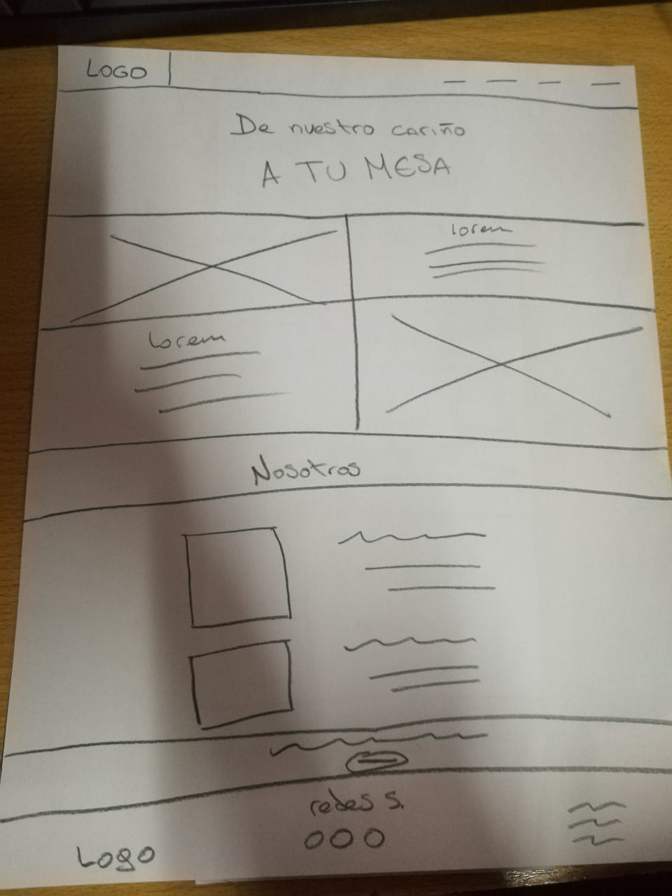
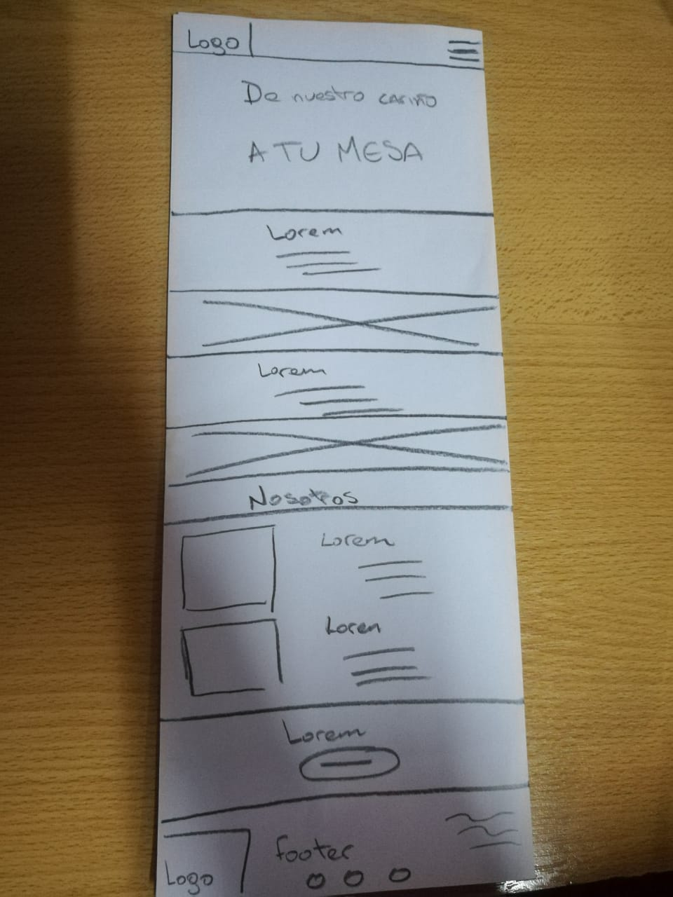

#TIATOMATE

----------

###Listado con los requerimientos visuales y técnicos de la web
- Ésta página web está enfocada a la venta de tomates
- Estructura visual:
	- Fuentes
		- OpenSans-Regular
		- Raleway-Bold
		- Raleway-ExtraLight
	- Colores:
		- (#E56353) Jelly Bean
		- (#686963) Granite Gray
		- (#707070) Nickel
		- (#FAFAFA) Snow
		- (#FFFFFF) White

	- Imagenes:
		- Entragadas por el cliente (vea carpeta "images")

###La Página web está dividida en 8 secciones:

1. Navbar
2. Cabecera
3. Visión del negocio
4. De donde vienen los productos
5. "Nosotros"
6. Información sobre los dueños y fundadores.
7. Invitación a comprar sus tomates.
8. Footer

###Requerimientos específicos:

- Mostrar logo
- Que sea responsivo
- El contenido sera por parte del negocio junto a los encargados de sus redes sociales.
- utilización de grillas Bootstrap

###Requerimientos visuales:

- Layout : Se hará con Bootstrap
- Fuentes: Vienen en el repositorio
- Titulos: Raleway Bold
- Parrafos: OpenSans-Regular
- Banner y footer: Raleway-Extralight

###Descripción de las secciones, layout, estructura HTML y clases CSS que decidí usar.

- Navbar
	- navbar
	- navbar_logo
	- navbar_navegation
- Header
	- header
	- header_tittle
- Article
	- blog
	- blog_container
	- blogcontainer_img01
	- blogcontainer_img02

	- headersecondary
	- headersecondary_tittle

	- us
	- uscontainer
	- uscontainer_img

	- sales
	- sales_tittle
	- sales_buttom

- Footer
	- footer
	- footer_logo
	- footer_social
	- footer_list

###Estructura de directorio

- **PROYECTO TIATOMATE**
	- README.md
	- index.html
	- assets/
		- css/
		- fonts/
		- images/
		- js/
                 
###Foto con los sketch de la versión escritorio y móvil.

**Versión escritorio**

**Versión móvil**
